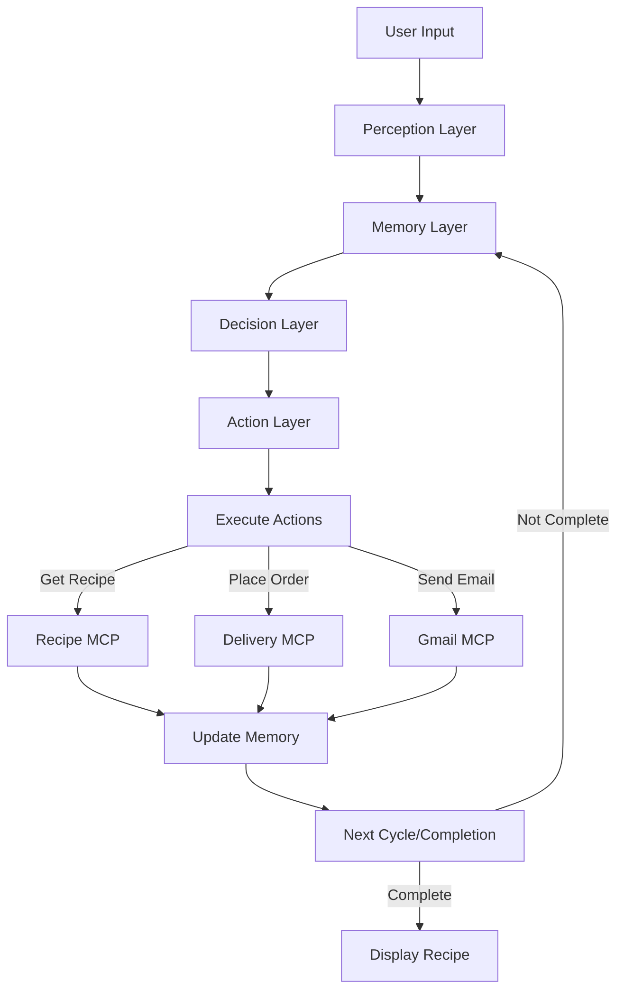
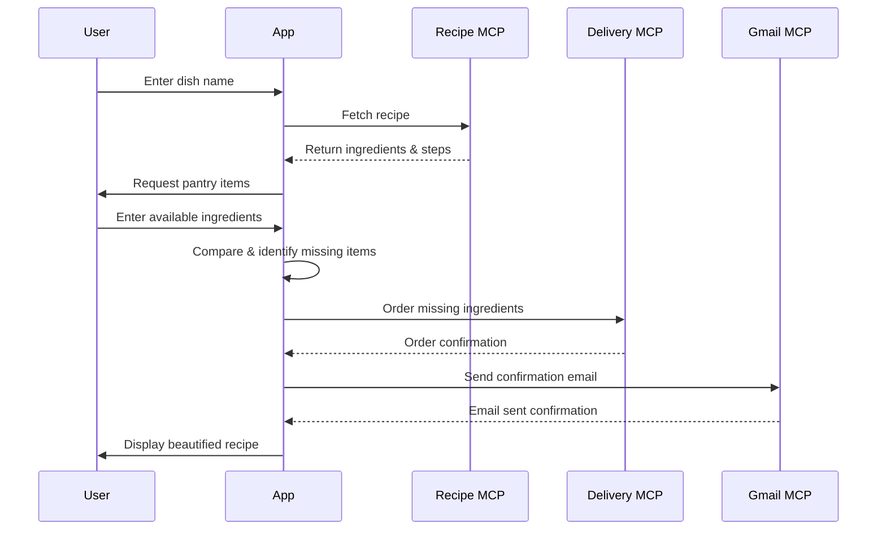

# 🥘 Recipe-based Grocery Assistant

> **An intelligent cooking assistant that helps you prepare delicious meals by automating recipe fetching, pantry checking, and grocery ordering!**

## ✨ Features

- 🧠 **Intelligent Conversation** - Natural language understanding of your cooking needs
- 📝 **Recipe Management** - Fetch detailed recipes with ingredients and step-by-step instructions
- 🍅 **Pantry Checking** - Compare required ingredients against what you have at home
- 🛒 **Automated Ordering** - Order missing ingredients with a single command
- 📧 **Email Notifications** - Receive order confirmations directly to your inbox
- 👨‍🍳 **Beautiful Recipe Display** - Get a beautifully formatted recipe to start cooking

## 📋 How It Works

The Recipe Grocery Assistant uses a cognitive architecture to help you cook any dish:

1. **Enter a dish name** - Just type what you want to cook
2. **Get the recipe** - The assistant fetches detailed ingredients and instructions
3. **Check your pantry** - Enter ingredients you already have at home
4. **Order missing items** - Automatically order what you're missing
5. **Receive confirmation** - Get an email with your order details
6. **Start cooking!** - Follow the beautifully formatted recipe

## 🔧 Technical Architecture

This application is built on a cognitive architecture called **PADM** (Perception, Action, Decision, Memory):

### PADM Architecture Components

The application uses a cognitive cycle based on four key components:

#### 🔍 Perception Layer
- Processes and understands user input
- Extracts dish names and user preferences
- Enhances understanding through LLM (Large Language Model)

#### 🧠 Memory Layer
- Maintains the application state
- Tracks recipe details, ingredients, and order information
- Stores user preferences and history

#### 🤔 Decision Layer
- Determines the next action based on current context
- Uses LLM to select appropriate steps in the workflow
- Handles errors and unexpected situations

#### 🛠️ Action Layer
- Executes decisions through specialized tools
- Interacts with external services (Recipe, Delivery, Email)
- Updates memory with results

## 🔄 Detailed Flow

## 🌟 Integration Architecture

The application connects multiple MCP (Multi-modal Conversational Process) services:

1. **Recipe MCP** - Manages recipe data and ingredient information
2. **Delivery MCP** - Handles ordering of missing ingredients
3. **Gmail MCP** - Provides email notification capabilities

Each MCP service operates independently but is orchestrated by the main application through the PADM architecture.

## 💻 Technical Implementation

- **Language**: Python with asyncio for concurrency
- **LLM Integration**: Google's Gemini API for natural language understanding
- **MCP Framework**: Custom framework for tool-based microservices
- **Logging**: Colorized, iteration-aware logging system
- **Error Handling**: Robust recovery mechanisms built into each layer

## 🚀 Getting Started

1. Clone the repository
2. Install dependencies: `pip install -r requirements.txt`
3. Configure credentials for Gmail service
4. Run the application: `python main.py`
5. Enter a dish name and follow the prompts!

## 📚 How the Code is Organized

- **main.py** - Application entry point and orchestration
- **perception.py** - User input understanding and interpretation
- **memory.py** - State management and persistence
- **decision.py** - LLM-based workflow decision making
- **action.py** - Execution of actions and external service calls
- **models.py** - Data structures and validation models
- **{service}_mcp_server.py** - Individual MCP service implementations

## 📝 License

This project is licensed under the MIT License - see the LICENSE file for details.

## 🙏 Acknowledgements

- Google Gemini API for natural language capabilities
- Colorama for terminal coloring
- Pydantic for data validation
- MCP framework contributors 