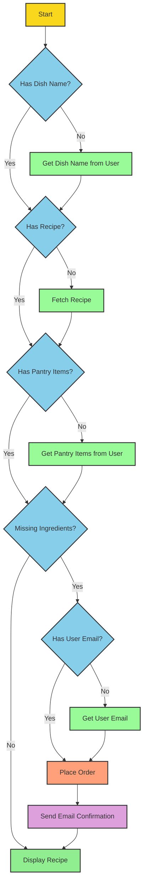

# 🍳 Smart Kitchen Assistant

A sophisticated AI-powered kitchen assistant that helps users manage recipes, ingredients, and grocery shopping seamlessly. The assistant uses a cognitive architecture to process user inputs, manage recipes, check pantry items, order missing ingredients, and send email confirmations.

## 🌟 High-Level Overview

The Smart Kitchen Assistant is an intelligent agent that:
- 🔍 Finds recipes based on user requests
- 📝 Checks available ingredients against recipe requirements
- 🛒 Automatically orders missing ingredients
- 📧 Sends email confirmations for orders
- 👩‍🍳 Provides step-by-step cooking instructions

## 🏗️ Technical Implementation

### Architecture Components

1. **Cognitive Layers**
   - `PerceptionLayer`: Handles user input and interaction
   - `MemoryLayer`: Manages state and persistence
   - `DecisionLayer`: Determines next actions
   - `ActionLayer`: Executes determined actions

2. **MCP Servers**
   - `recipe_mcp_server.py`: Manages recipe database and ingredient comparison
   - `delivery_mcp_server.py`: Handles order placement and tracking
   - `gmail_mcp_server.py`: Manages email notifications

3. **Core Components**
   - `main.py`: Orchestrates the entire process
   - `models.py`: Defines data structures and type definitions

### Process Flow


```mermaid
graph TD
    A[Start] --> B{Has Dish Name?}
    B -->|No| C[Get Dish Name from User]
    B -->|Yes| D{Has Recipe?}
    C --> D
    
    D -->|No| E[Fetch Recipe]
    D -->|Yes| F{Has Pantry Items?}
    E --> F
    
    F -->|No| G[Get Pantry Items from User]
    F -->|Yes| H{Missing Ingredients?}
    G --> H
    
    H -->|Yes| I{Has User Email?}
    H -->|No| M[Display Recipe]
    I -->|No| J[Get User Email]
    I -->|Yes| K[Place Order]
    
    J --> K
    K --> L[Send Email Confirmation]
    L --> M
    
    style A fill:#f9d71c,stroke:#333,stroke-width:2px
    style B fill:#87ceeb,stroke:#333,stroke-width:2px
    style C fill:#98fb98,stroke:#333,stroke-width:2px
    style D fill:#87ceeb,stroke:#333,stroke-width:2px
    style E fill:#98fb98,stroke:#333,stroke-width:2px
    style F fill:#87ceeb,stroke:#333,stroke-width:2px
    style G fill:#98fb98,stroke:#333,stroke-width:2px
    style H fill:#87ceeb,stroke:#333,stroke-width:2px
    style I fill:#87ceeb,stroke:#333,stroke-width:2px
    style J fill:#98fb98,stroke:#333,stroke-width:2px
    style K fill:#ffa07a,stroke:#333,stroke-width:2px
    style L fill:#dda0dd,stroke:#333,stroke-width:2px
    style M fill:#90ee90,stroke:#333,stroke-width:2px
```

### Detailed Implementation

#### 1. Initialization
- Environment setup using `.env` file
- MCP server initialization
- Cognitive layer initialization
- Memory state initialization

#### 2. User Interaction Flow
1. **Recipe Selection**
   - User provides dish name
   - System fetches recipe details
   - Recipe stored in memory

2. **Ingredient Management**
   - System lists required ingredients
   - User indicates available ingredients
   - System identifies missing items

3. **Order Processing**
   - System collects user email
   - Places order for missing ingredients
   - Sends confirmation email

4. **Recipe Presentation**
   - Displays complete ingredient list
   - Shows step-by-step instructions
   - Indicates which items were ordered

#### 3. Memory Management
- Persistent storage using JSON
- State tracking across sessions
- Real-time updates during process

#### 4. Error Handling
- Input validation
- Service availability checks
- Graceful error recovery
- User feedback for issues

## 🛠️ Technical Requirements

- Python 3.8+
- Required packages:
  - `mcp`: For server communication
  - `google-auth`: For Gmail integration
  - `python-dotenv`: For environment management
  - `colorama`: For colored console output

## 📁 Project Structure

```
Assignment/
├── main.py                    # Main orchestration script
├── models.py                  # Core data models and types
├── perception.py             # Perception layer implementation
├── memory.py                 # Memory layer implementation
├── decision.py              # Decision layer implementation
├── action.py                # Action layer implementation
├── MCP_SERVERS/             # MCP server implementations
│   ├── recipe_mcp_server.py
│   ├── delivery_mcp_server.py
│   ├── gmail_mcp_server.py
│   └── models.py            # Server-specific models
├── credentials/             # Configuration and authentication
│   ├── .env                # Environment variables
│   ├── credentials.json    # Gmail API credentials
│   └── token.json         # Gmail API tokens
└── MEMORY/                 # Persistent storage
    └── agent_memory.json   # Agent's memory state
```

## 🚀 Getting Started

1. Clone the repository
2. Set up credentials in `credentials/` directory
3. Install dependencies: `pip install -r requirements.txt`
4. Run the assistant: `python main.py`

## 🔐 Environment Setup

Required environment variables in `.env`:
```
GEMINI_API_KEY=your_api_key_here
```

## 📝 Usage Example

```bash
$ python main.py
> What would you like to cook? chicken curry
> Which ingredients do you have? chicken breast, onion, ginger, curry powder
> Please provide your email: user@example.com
> Order placed! Check your email for confirmation.
> Here are your cooking instructions...
``` 